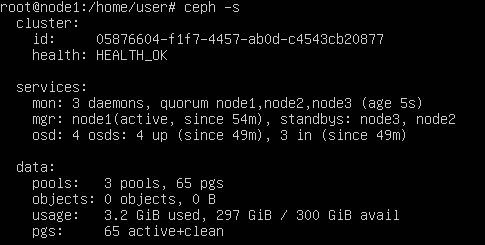
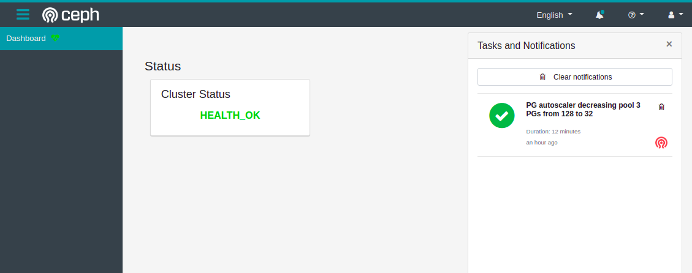

# Ansible for a Ceph cluster

## Ceph baremetal
As of today, the usage of this playbook is as follows:
setting the hosts in `hosts` file and running `ansible-playbook playbooks/all.yml -vvv` from the ceph directory.
To be absolutely sure everything works, running 
`ansible-playbook playbooks/all.yml -vvv --tags tag_ntp,tag_mon1,tag_synchro,tag_quorum,tag_osd,tag_pool`
is advised.

## Ceph container
TBA
